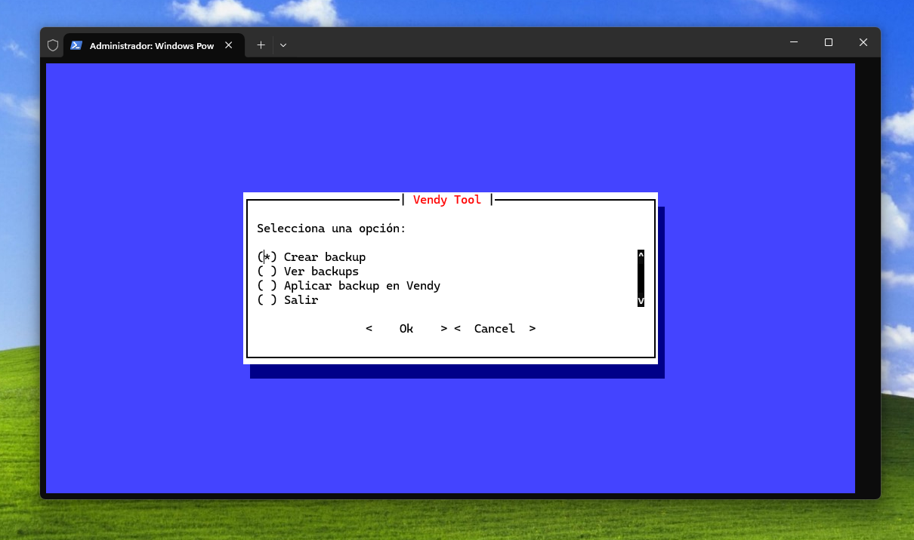

# Vendy Tool

Herramienta de desarrollo creada en Python para gestionar copias de seguridad de la aplicación [**Vendy**](https://github.com/Wyxemon/Vendy), mediante el acceso a Firebase Realtime Database.

Permite crear backups, visualizarlos y restaurarlos fácilmente desde una interfaz interactiva en terminal.

<sub style="color: gray;">
Vendy aplikazioaren segurtasun-kopiak kudeatzeko Python tresna bat da, Firebase Realtime Database-ra konektatuz. Backup-ak sortu, ikusi eta kopiak ezartzea ahalbidetuz, terminal interfaza baten bidez.
</sub>

&nbsp;




---

## Tecnologías utilizadas

| Tecnología | Descripción |
|---|---|
| Python 3 | Lenguaje principal |
| `firebase-admin` | Acceso a Firebase Realtime Database |
| `prompt-toolkit` | Interfaz interactiva en terminal |

---

## Instalación

```bash
# 1. Clona el repositorio
git clone https://github.com/Wyxemon/Vendy-tool.git

# 2. Entra en el directorio
cd Vendy-tool

# 3. Instala las dependencias
pip install -r requirements.txt
```

---

## Configuración

Este proyecto requiere un archivo de credenciales de Firebase para conectarse a la base de datos.

**1.** Descarga el archivo desde el siguiente enlace:

> [ Descargar `serviceAccountKey.json`](https://drive.google.com/file/d/1ekmEOmNRCw1nlS7IhdQZnho6PE0ZnOop/view?usp=sharing)

**2.** Colócalo en la raíz del proyecto:

```
Vendy-tool/
└── serviceAccountKey.json  ← aquí
```

> ⚠️ **Nunca subas este archivo al repositorio.** Asegúrate de que esté en tu `.gitignore`.

---

## Ejecución

```bash
python main.py
```

---

## Funcionalidades

| | Función | Descripción |
|---|---|---|
|  | **Crear backup** | Genera una copia de seguridad del estado actual de la base de datos |
|  | **Visualizar backups** | Explora y consulta los backups guardados desde la terminal |
|  | **Restaurar backup** | Recupera la base de datos a un estado anterior |

---

## Estructura del proyecto

```
Vendy-tool/
├── main.py
├── requirements.txt
├── serviceAccountKey.json  # ← No incluido en el repositorio
└── README.md
```

---

## Autor

**Iñigo Viscarret Alvarez** · [@Wyxemon](https://github.com/Wyxemon)